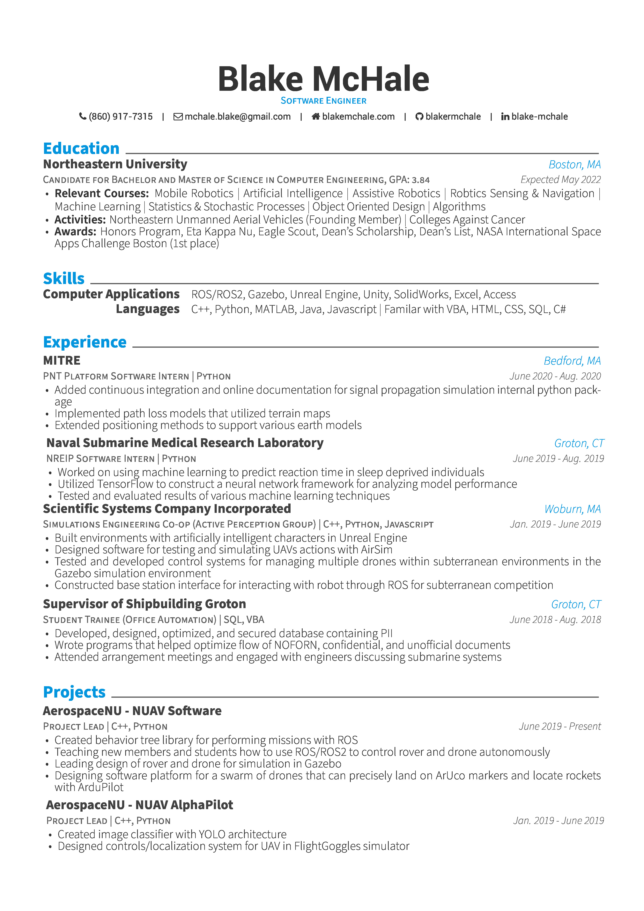

# resume
My resume, largely sourced and inspired from [Awesome CV](https://github.com/posquit0/Awesome-CV). It is also derived from [Juhao Dong's Resume](https://github.com/junhaodong/resume).

View the [PDF](https://docs.google.com/viewer?url=https://raw.githubusercontent.com/blakermchale/resume/master/resume.pdf).

  

## Quick Start
Feel free to modify my `.tex` file to create your own resume! Please don't use my resume for anything else without permission though.

## Build

### PDF

`xelatex resume.tex`

### PNG

`magick resume.pdf -background white -alpha remove -alpha off resume.png`

### JPG

`magick -density 400 -colorspace RGB resume.pdf resume.jpg`
